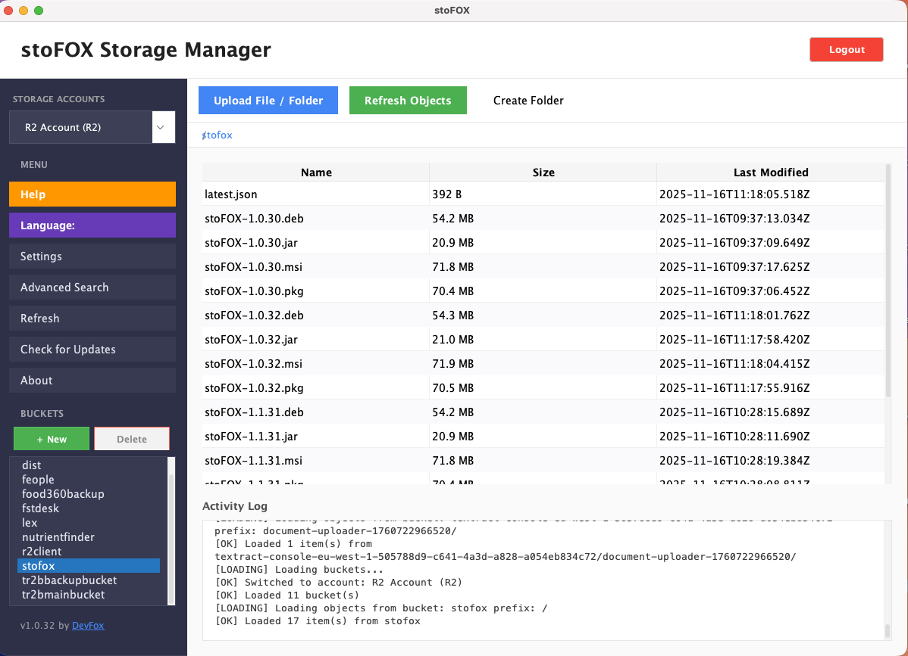

# 🦊 stoFOX - Your Cloud Storage, Now in Your Pocket!

**Store your files in the cloud, access them from anywhere!**

stoFOX is a modern desktop application that lets you **easily manage** cloud storage services like Amazon S3 and Cloudflare R2. Instead of struggling with complex web interfaces, manage your cloud files just like files on your computer!

---

## 🌟 Why stoFOX?

### 💰 Save Your Money
Amazon S3 and Cloudflare R2 offer **very cheap** alternatives for storing your files in the cloud. Using these services with stoFOX:
- **10x cheaper** storage than Google Drive
- **20x cheaper** file sharing than Dropbox
- **Unlimited** storage for just a few dollars per month

### 🚀 Fast and Easy
- **Drag-and-drop** file uploads
- Manage all your accounts **in one place**
- Upload your folder structure **as-is**
- Search files in **seconds**

### 🔒 Secure and Professional
- Your files are stored on **secure servers** of major companies (Amazon, Cloudflare)
- **3-step protection** against accidental deletion
- Multiple account support to separate **work and personal** files

---

## 📸 Screenshots

### Main Screen - See Your Files

*All your files at a glance - with size, date, and folder information*

### Smart Search - Find Everything

*Search by filename or content - even scans inside PDFs!*

### Multi-Account Management

*Work, personal, projects - manage all accounts in one program*

### File Preview

*Images, PDFs, text files - preview before downloading*

---

## ✨ Features

### 🔍 Powerful Search
- **Search by filename**: Where did I put that photo? Find it instantly!
- **Content search**: Search for words inside PDF and text files
- **Filtered search**: Only images, only PDFs - filter as you like
- **Search across all accounts**: Find files even if you forgot which account!

### 📁 Folder Management
- **Folder upload**: Upload entire folders as-is
- **Browse subfolders**: Navigate through folder hierarchies
- **Folder statistics**: See file count, total size
- **Bulk delete**: Delete entire folders at once (with 3-step confirmation!)

### 🎨 File Preview
- **Images**: JPG, PNG, GIF - view everything in the app
- **PDFs**: Navigate page by page, zoom in
- **Text files**: TXT, JSON, code files - read and check

### 🛡️ Security
- **3-step deletion**: Protection against accidental deletion
  1. "Are you sure?" question
  2. 3-second countdown (you can cancel!)
  3. Final confirmation - now it's really deleting
- **File encryption**: Your files are safe on secure servers

### ⚡ Performance
- **Unlimited files**: Thousands, tens of thousands of files - no problem
- **Fast uploads**: Track large files with progress bar
- **Multiple downloads**: Download multiple files simultaneously
- **Cancellable operations**: Started by mistake? Cancel it!

### 🌍 Multi-Account
- **Unlimited accounts**: Add as many accounts as you want
- **Quick switch**: Switch between accounts with one click
- **Amazon S3**: World's most popular cloud storage
- **Cloudflare R2**: 90% cheaper alternative to S3!

---

## 💾 Download and Installation

### Windows Users
1. [Download Latest Version](../../releases/latest) - Download `stoFOX-Setup.msi` file
2. Double-click the downloaded file
3. Follow the installation wizard
4. **That's it!** No need to install Java!

### macOS Users (Intel and M1/M2/M3/M4)
1. [Download Latest Version](../../releases/latest) - Download `stoFOX.pkg` file
2. Double-click the downloaded file
3. Follow the installation wizard
4. **That's it!** No need to install Java!

### Linux Users
1. [Download Latest Version](../../releases/latest) - Download `stoFOX.jar` file
2. Make sure Java 17 is installed
3. In terminal: `java -jar stoFOX.jar`

---

## 🚀 Quick Start

### 1. Open the Program
After installation, open stoFOX from your desktop or Start Menu.

### 2. Add an Account
- Click **"Settings"** button from left menu
- Click **"Add Account"** button
- Enter your account information:
  - **Account name**: E.g., "My Work Account", "Personal Photos"
  - **Provider**: Amazon S3 or Cloudflare R2
  - **Access credentials**: Information obtained from your cloud service

### 3. Upload Files
1. Select a **bucket** (storage) from the left side
2. Click **"Upload"** button
3. Select your file or **drag-and-drop** it
4. Upload starts automatically!

### 4. Search Files
1. Click **"Search"** button from left menu
2. Type the word you want to search
3. Select your desired filters:
   - Search in all accounts?
   - Only PDFs?
   - Search in file contents?
4. Click **"Search"** button
5. View, download, or delete results!

---

## 💡 Use Cases

### 📷 For Photographers
"My wedding photos are 100 GB - won't fit on Google Drive!"
→ With Cloudflare R2, pay **only $2-3 per month**!

### 🎬 For Video Editors
"My old project files are filling up my computer!"
→ Upload to S3 with stoFOX, archive them, get them back when needed!

### 📁 For Office Workers
"Work files at home, home files at work - what a mess!"
→ Open two separate accounts, manage both in stoFOX!

### 🎓 For Students
"I want to backup my thesis files, projects, assignments!"
→ Store safely on S3, access for lifetime!

---

## 🔧 What are Amazon S3 and Cloudflare R2?

### Amazon S3 (Simple Storage Service)
Amazon's cloud storage service. The world's most reliable and widely used storage system.

**Price Example:**
- 1 TB storage: ~$23/month
- First 5 TB download: Free
- After that: $0.09/GB

**Who Uses It?**
Netflix, Airbnb, NASA, and many major companies worldwide!

### Cloudflare R2
Fully compatible with S3 but **much cheaper** alternative!

**Price Example:**
- 1 TB storage: ~$15/month
- **Download fee: ZERO!** 🎉
- 10 million file operations/month: Free

**Why Cheaper?**
Cloudflare doesn't charge for downloads - only for storage!

### Comparison

| Feature | Google Drive | Dropbox | S3 (1TB) | R2 (1TB) |
|---------|--------------|---------|----------|----------|
| Monthly Cost | $10 | $12 | $23 | $15 |
| Storage Limit | 2 TB | 2 TB | Unlimited | Unlimited |
| Download Fee | - | - | Yes | NO! |
| API Access | Limited | Limited | Full | Full |
| stoFOX Support | ❌ | ❌ | ✅ | ✅ |

---

## 🎯 Frequently Asked Questions

### ❓ "Is cloud storage secure?"
**Yes!** Amazon and Cloudflare are among the world's largest tech companies. Your files are:
- Stored encrypted
- Backed up in multiple locations
- Only accessible by you

### ❓ "Is installation difficult?"
**No!** One-click installation - you don't even need to install Java!

### ❓ "Is it paid?"
stoFOX is **completely free**! You only pay for the cloud storage you use (S3 or R2) - which is very cheap!

### ❓ "Will my files get lost?"
**No!** Amazon and Cloudflare guarantee 99.999999999% (11 nines!) data durability. Your files are virtually impossible to lose!

### ❓ "Can I use it without internet?"
You need internet to view and download files. But you can download files to your computer for offline work.

### ❓ "How many accounts can I add?"
**Unlimited!** Work, home, archive - add as many accounts as you want, let stoFOX manage them all!

### ❓ "Is there a file size limit?"
stoFOX itself has no limit - but S3 and R2 have limits:
- Single file: Up to 5 TB (!)
- Total storage: Unlimited

---

## 🛠️ Support and Help

### 📧 Contact
Having issues? Have suggestions?
- [Open an Issue](../../issues) - Get support on GitHub
- [DevFox](https://devfox.net) - Developer website

### 📚 Help Resources
- [Opening Amazon S3 Account](https://aws.amazon.com/s3/)
- [Opening Cloudflare R2 Account](https://www.cloudflare.com/products/r2/)
- [Video Tutorials](#) - Coming soon!

---

## 🎁 Bonus Features

### 🔄 Auto-Update
The program checks for new versions every time you open it. When new features are released:
- Windows/macOS: Auto-update suggestion
- One-click update
- None of your settings are lost!

### 🎨 Modern Design
- Eye-friendly light theme
- Large, readable fonts
- Colorful icons and visuals
- Quick access menus

### ⌨️ Keyboard Shortcuts
- **Ctrl/Cmd + U**: Quick upload
- **Ctrl/Cmd + F**: Open search
- **Delete**: Delete selected file
- **Enter**: Open/preview file

---

## 🌟 Coming Soon

- [ ] 🌙 Dark theme
- [ ] 🔗 Create sharing links
- [ ] 📊 Storage statistics and charts
- [ ] 🗂️ Bulk file operations
- [ ] 📱 Mobile app

---

## 📄 License

stoFOX is open source and free. Use it for personal or commercial purposes - completely free!

---

## 💖 Thank You

Thank you for using stoFOX! If you like it:
- ⭐ Star it on GitHub
- 🐦 Recommend to your friends
- 💬 Send feedback

**by [DevFox](https://devfox.net)** 🦊

---

  
### 📥 [Download Now and Start Using!](../../releases/latest)

**Your cloud storage, now in your pocket!** 🚀

